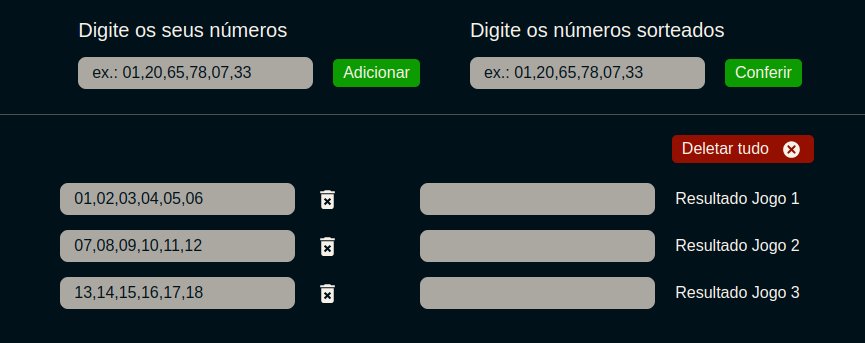
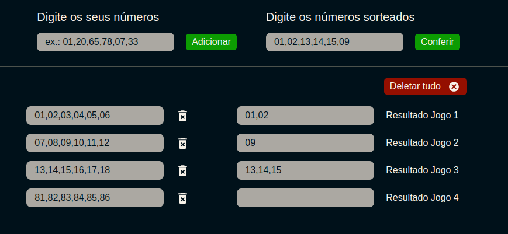

# Check Numbers

Quem nunca sonhou em ganhar na mega-sena, ou qualquer jogo desses, a gente chega participar até de bolão, o problema é que fica muitos jogos para conferir um a um, e essa app veio pensando em resolve esse problema!

[Acesse o app aqui](https://gabriel-vitebo.github.io/checkNumbers/)

## O que o app faz
O app vai verificar todos os seus jogos cadastrados, um por um, e verificar com o resultado da mega-sena ou de qualquer outro jogo, no final, na frente de cada jogo, terá o campo de resultados, mostrando quais foram os números que você acerto em cada jogo

### Cadastre os seus jogos, um por um:

- O jogo ficará salvo em localStorage, ou seja, está salvo apenas no seu navegador.
Isso permite você atualizar ou fechar a página sem perde nenhum jogo cadastrado, assim, você pode adicionar os jogos, e espera o dia que sair o resultado para conferir.

- Você tem a opção de deletar todos os jogos, depois que você conferiu os resultados, pode deletar todos os jogos, e quando for jogar novamente, e só cadastrar os novos números.
Você também tem a opção de deletar apenas um jogo especifico, caso tenha errado algum número, ou não quer mais aquele jogo ali, só clicar no ícone de lixeira em frente ao jogo, que removerá apenas aquele jogo

### Verifique os resultados dos jogos

- Quando chegar o dia que sair os números oficiais do resultado do jogo, basta digitar no campo "Resultado" e clicar em conferir,

- Na frente do campo, aparecerá apenas os números que você acertou. Note que quando não há acertos, o campo de resultado fica vazio

## Tecnologias usadas:
- React
- TypeScript
- Vite
- Eslint
- Styled Components

### Feito com ❤️ por Gabriel Vitebo 👋🏽 Entre em contato!

 
  
  
  

